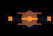
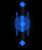
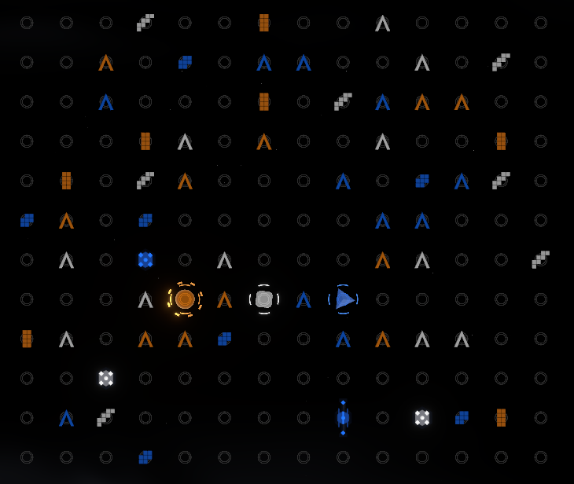
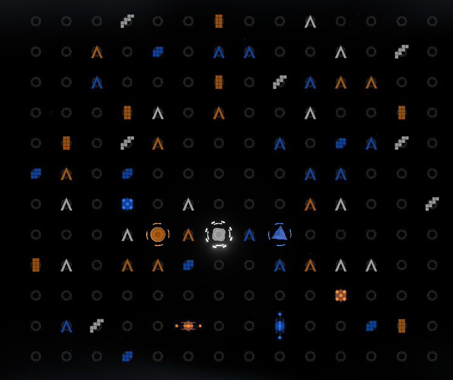
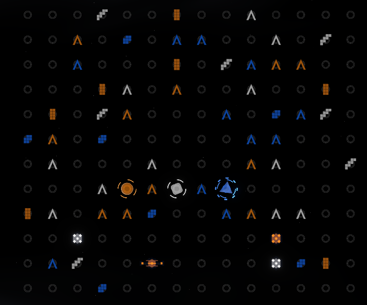
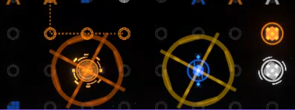
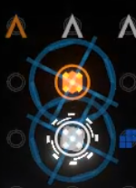

# Mine System — Technical Breakdown

During my 2026 internship with Nexus Games, I designed and implemented a mine-based gameplay system for **Polar Winds**, a real-time multiplayer game developed on the Atlas Arena platform.

The feature was integrated into an existing TypeScript multiplayer codebase and required work across server gameplay logic, synchronized state, client rendering, visual and audio feedback, scoring, gameplay iteration, and developer testing tools.

I initially implemented a larger prototype and later revised the system based on gameplay and presentation feedback. The final repository state is represented by commit `1738b68`.

---

## Final Mine System

The final build contains three mine types:

| Mine Type | Blast Behavior |
| --- | --- |
| **Square** | Clears a 3×3 area centered on the mine |
| **Horizontal** | Clears the entire visible row containing the mine |
| **Vertical** | Clears the entire visible column containing the mine |

### Final Mine Designs

<p align="center">
  
  
  
</p>

<p align="center">
  <strong>Square</strong>
  &nbsp;&nbsp;&nbsp;&nbsp;&nbsp;&nbsp;&nbsp;&nbsp;
  <strong>Horizontal</strong>
  &nbsp;&nbsp;&nbsp;&nbsp;&nbsp;&nbsp;&nbsp;&nbsp;
  <strong>Vertical</strong>
</p>

The directional mines remain fixed in orientation so their blast direction can be understood visually before they are activated.

---

## Color-Based Gameplay

Each mine is associated with one of the game's three player colors:

- Orange / `RED`
- White / `GREEN`
- Blue / `BLUE`

Player perspective is an important part of the mechanic.

A player cannot see inactive mines matching their own color. Mines belonging to the other player colors remain visible.

Once a mine has been triggered, it becomes visible regardless of the viewing player's color.

### Player Perspectives

The following screenshots show the board from each player-color perspective.

#### Orange Player Perspective



#### White Player Perspective



#### Blue Player Perspective



Because each player sees a different set of hidden mines, the same board state can present different information depending on the active player.

### Client Visibility Logic

The final client keeps every mine synchronized locally and determines whether it should be visible based on the current player's color and the mine's triggered state.

```ts
const minesWithVisibility = useMemo(() => {
  return mines.map((mine) => ({
    mine,
    visible:
      !mineViewerColor ||
      mine.triggered ||
      mine.color === "NEUTRAL" ||
      mine.color !== mineViewerColor,
  }));
}, [mines, mineViewerColor]);
```

This allows the gameplay rule to remain readable while still preserving the synchronized mine state received from the server.

---

## Mine Triggering

Only a player whose color matches an inactive mine can trigger it.

When a mine activates:

1. The mine enters its triggered state.
2. Its blast area is calculated by the server.
3. Player-created line cells inside the blast area are removed.
4. A **5-point team penalty** is applied.
5. The server broadcasts the event to connected clients.
6. Clients display the explosion effect and audio feedback.

The mine itself is not immediately removed.

Instead, it remains on the board in a visibly activated state.

---

## Explosion and Chain Reactions

Mines caught inside another mine's blast area can also be triggered.

The final version deliberately limits the size of these reactions:

- The original explosion may activate one randomly selected mine inside its blast area.
- That second mine performs its normal explosion and penalty behavior.
- A mine activated through the chain cannot continue the chain into additional mines.

This allowed chain reactions to create unpredictable gameplay without producing uncontrolled cascades across the entire board.

### Chain-Reaction Sequence

<p align="center">
  
  
</p>

### Server-Side Chain Logic

The server tracks the chain depth and only searches for another mine when the original mine is detonating.

```ts
// Chain reaction: the original blast may trigger one random nearby mine.
// Chained mines still clear their own blast area, but cannot continue the chain.
if (chainDepth === 0) {
  const chainedCandidates = Array.from(this.state.mines).filter(
    (otherMine) =>
      !otherMine.triggered &&
      otherMine.id !== detonatedMine.id &&
      blastCellKeys.has(`${otherMine.x},${otherMine.y}`)
  );

  if (chainedCandidates.length > 0) {
    const chainedMine =
      chainedCandidates[
        Math.floor(this.rng.next() * chainedCandidates.length)
      ];

    this.detonateMine(chainedMine, "chain", chainDepth + 1);
  }
}
```

This logic is handled by the server so connected clients receive the same resulting game state.

---

## Triggered Mine State and Team Resolution

Triggered mines remain on the board rather than disappearing immediately.

They receive stronger visual feedback so players can distinguish an activated mine from an inactive hazard.

<p align="center">
  
</p>

A triggered mine can then be resolved by a player of a different color.

When another player moves onto the triggered mine:

- The mine is resolved.
- Its active 5-point team penalty is refunded.
- The mine returns to its normal state.

This creates a cooperative interaction where one player's hidden hazard becomes something another teammate can respond to.

---

## Stage-Based Spawning

Mine spawning scales with game progression.

- **Stage 1:** no mines are added.
- **Stages 2–3:** one new mine per player color is added each stage.
- **Later stages:** two new mines per player color are added each stage.

Existing mines remain on the board when later stages introduce additional hazards.

Mine-type selection is also weighted by stage. Square mines are favored earlier, while horizontal and vertical directional mines become increasingly likely as the game progresses.

Placement logic prevents mines from spawning:

- On occupied board positions
- On existing mines or actors
- On a trail matching the mine's own color

A mine can still overlap a trail belonging to a different player color.

---

## Multiplayer State

Mine data is stored as synchronized server state using Colyseus.

Each mine contains information such as:

- Board position
- Unique ID
- Player color
- Mine type
- Triggered state
- Whether its scoring penalty is active

The final synchronized mine types are:

```ts
export type MineType =
  | "square"
  | "horizontal"
  | "vertical";
```

Gameplay events including detonation, chain reactions, penalties, and resolution are handled by the server rather than being simulated independently by each client.

This keeps mine behavior consistent across multiplayer sessions.

---

## Rendering and Visual Feedback

The client-side mine system uses **React Three Fiber** and **Three.js**.

Each mine type has a different physical silhouette:

- Square mines use a compact central body.
- Horizontal mines include left/right directional elements.
- Vertical mines use the same design language oriented along the vertical board axis.

Triggered mines receive additional feedback including:

- Increased emissive glow
- Faster vertical movement
- Pulsing scale
- An animated indicator ring
- Temporary explosion effects
- Explosion audio

During the final feedback revision, hidden mines were changed so they remain mounted in the scene while their visibility is toggled.

This avoids repeatedly destroying and recreating Three.js objects when switching player perspectives and helps reduce unnecessary WebGL work.

---

## Explosion Audio

I also implemented client-side explosion feedback using the Web Audio API.

The effect combines components such as:

- A low-frequency impact
- A short filtered noise burst
- Rapid frequency and volume falloff

Audio handling was designed so failure to initialize browser audio would not interrupt the underlying gameplay.

---

## Developer Testing Tools

I also created internal development utilities to make testing later-stage mine behavior significantly faster.

### Server-Backed Stage Skip

The development stage-skip control advances the actual server game state rather than only changing the client display.

This allowed me to move directly to later stages where more mines were present without replaying the earlier stages repeatedly.

The local shortcut is:

`F8`

The client sends a real request to the active game room:

```ts
if (!room) {
  console.warn(
    "[DevStageControls] No active room yet. Start the game first."
  );
  return;
}

room.send("devStageUp", {});
```

### Board Fill Tool

I also added a development command that fills available board cells with normal player line cells.

The local shortcut is:

`F7`

This made it much faster to test:

- Square blast areas
- Horizontal line destruction
- Vertical line destruction
- Explosion feedback
- Chain reactions
- Scoring and penalty behavior

These tools reduced the amount of setup needed to repeatedly reproduce mine interactions during development.

---

## Room Randomization

As part of my final feedback revision, I changed room initialization so a fresh random seed is generated for each game room unless an explicit seed is supplied.

This prevented solo and multiplayer sessions from unintentionally reusing the same fallback seed every time.

Explicit seeds are still supported, allowing deterministic behavior when reproducibility is useful for development or testing.

---

## Iteration

The original mine-system prototype was broader than the final design.

My first major implementation experimented with six mine types:

- Square
- Horizontal
- Vertical
- Cross
- Diagonal
- Cluster

During testing and iteration, the design was narrowed to the three types used in the final build:

**Square, Horizontal, and Vertical.**

Other gameplay, scoring, visual-feedback, and chain-reaction behavior also changed during the development process.

This gave me experience working through the full feature-development cycle:

**implementation → integration → testing → feedback → revision**

rather than treating the initial version of the feature as finished.

---

## Contribution History

### Initial Mine-System Implementation

[984909f — Add mine system and gameplay improvements](https://github.com/sabidmahmud01/polar-winds-standalone/commit/984909f)

This commit introduced the original mine system across the client and server.

### Final Feedback Revision

[1738b68 — Refine mine feedback and randomize room seeds](https://github.com/sabidmahmud01/polar-winds-standalone/commit/1738b68)

This is the final commit in the internship repository and represents the final project state.

---

## Technologies Used

- TypeScript
- React
- React Three Fiber
- Three.js
- Colyseus multiplayer synchronization
- Web Audio API
- Git / GitHub
- Atlas Arena

---

## Project Context

Polar Winds was developed collaboratively by a five-person internship team during my 2026 internship with Nexus Games.

This page focuses specifically on the mine-system implementation, development/testing utilities, and related revisions that I contributed.

The complete game contains systems and work created by the rest of the team and should not be interpreted as my individual project.

[View the original Polar Winds team repository](https://github.com/sabidmahmud01/polar-winds-standalone)
